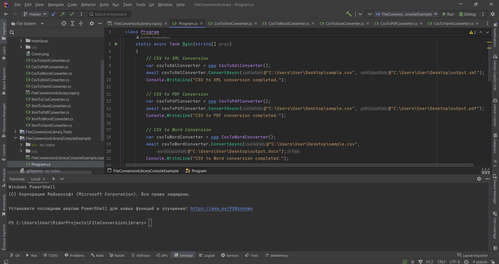

# File Conversion Library


A powerful .NET library for converting CSV and XML files to various formats including XML, PDF, Word, JSON, and YAML. Now with enhanced Stream API and In-Memory conversion capabilities!

## **New Features in v1.5.0**

- **Stream API**: Convert data directly from streams without temporary files
- **In-Memory Conversion**: Work with data objects directly in memory
- **Advanced Options**: Comprehensive configuration options for all formats
- **Enhanced Performance**: Optimized for large datasets
- **Type-Safe Configuration**: Strongly-typed options classes

## **Usage**

### **Basic File Conversion (Original API)**

```csharp
// Create a new instance of the FileConverter
var fileConverter = new FileConverter();
```

#### CSV Conversions
```csharp
// CSV to JSON
await fileConverter.ConvertCsvToJsonAsync(
    @"C:\input.csv", 
    @"C:\output.json"
);

// CSV to XML with options
await fileConverter.ConvertCsvToXmlAsync(
    @"C:\input.csv",
    @"C:\output.xml",
    CsvToXmlConverter.XmlOutputFormat.Elements,
    useCData: true,
    useTabsForIndentation: false,
    indentSize: 2
);

// CSV to PDF
await fileConverter.ConvertCsvToPdfAsync(
    @"C:\input.csv",
    @"C:\output.pdf"
);

// CSV to Word
await fileConverter.ConvertCsvToWordAsync(
    @"C:\input.csv",
    @"C:\output.docx"
);

// CSV to YAML
await fileConverter.ConvertCsvToYamlAsync(
    @"C:\input.csv",
    @"C:\output.yaml"
);
```

#### XML Conversions
```csharp
// XML to CSV
await fileConverter.ConvertXmlToCsvAsync(
    @"C:\input.xml",
    @"C:\output.csv",
    delimiter: ',',
    includeAttributes: true
);

// XML to JSON
await fileConverter.ConvertXmlToJsonAsync(
    @"C:\input.xml",
    @"C:\output.json",
    convertValues: true,
    removeWhitespace: true
);

// XML to PDF
await fileConverter.ConvertXmlToPdfAsync(
    @"C:\input.xml",
    @"C:\output.pdf",
    hierarchicalView: false,
    fontSize: 10f
);

// XML to Word
await fileConverter.ConvertXmlToWordAsync(
    @"C:\input.xml",
    @"C:\output.docx",
    useTable: true,
    fontFamily: "Calibri"
);

// XML to YAML
await fileConverter.ConvertXmlToYamlAsync(
    @"C:\input.xml",
    @"C:\output.yaml",
    useCamelCase: false
);
```

### **Stream API**

Perfect for web applications, cloud services, and scenarios where you work with streams:

```csharp
var fileConverter = new FileConverter();

// Convert from stream to stream
using var inputStream = File.OpenRead("input.csv");
var options = new ConversionOptions 
{ 
    SourceFormat = "csv", 
    TargetFormat = "json" 
};

using var outputStream = await fileConverter.ConvertStreamAsync(inputStream, options);

// Convert stream to bytes (for HTTP responses)
var pdfBytes = await fileConverter.ConvertStreamToBytesAsync(inputStream, new ConversionOptions 
{ 
    SourceFormat = "csv", 
    TargetFormat = "pdf" 
});

// Convert stream to string
var jsonString = await fileConverter.ConvertStreamToStringAsync(inputStream, new ConversionOptions 
{ 
    SourceFormat = "csv", 
    TargetFormat = "json" 
});
```

#### Web API Example
```csharp
[HttpPost("convert")]
public async Task<IActionResult> ConvertFile(IFormFile file, string targetFormat)
{
    var options = new ConversionOptions 
    { 
        SourceFormat = "csv", 
        TargetFormat = targetFormat 
    };
    
    using var inputStream = file.OpenReadStream();
    var result = await fileConverter.ConvertStreamToBytesAsync(inputStream, options);
    
    return File(result, GetMimeType(targetFormat), $"converted.{targetFormat}");
}
```

### **💾 In-Memory API**

Work directly with data objects for maximum performance and flexibility:

```csharp
var fileConverter = new FileConverter();

// Create data in memory
var csvData = new CsvData 
{ 
    Headers = new[] { "Name", "Age", "City" },
    Rows = new List<string[]> 
    {
        new[] { "John Doe", "25", "New York" },
        new[] { "Jane Smith", "30", "London" }
    }
};
```

#### Advanced JSON Conversion
```csharp
var jsonOptions = new JsonConversionOptions 
{ 
    ConvertValues = true,
    UseIndentation = true,
    IncludeRowNumbers = true,
    CreateNestedObjects = true,
    NestedSeparator = ".",
    ConvertArrays = true,
    ArrayDelimiter = ";"
};

var json = fileConverter.ConvertCsvToJson(csvData, jsonOptions);
```

#### Advanced PDF Conversion
```csharp
var pdfOptions = new PdfConversionOptions 
{ 
    FontSize = 12f,
    Title = "Sales Report",
    IncludeTimestamp = true,
    AlternateRowColors = true,
    LandscapeOrientation = true,
    FontFamily = "Arial"
};

var pdfBytes = fileConverter.ConvertCsvToPdf(csvData, pdfOptions);
```

#### Advanced Word Conversion
```csharp
var wordOptions = new WordConversionOptions 
{ 
    UseTable = true,
    FontFamily = "Calibri",
    FontSize = 11,
    AlternateRowColors = true,
    PageOrientation = "Landscape"
};

var wordBytes = fileConverter.ConvertCsvToWord(csvData, wordOptions);
```

#### Advanced XML Conversion
```csharp
var xmlOptions = new XmlConversionOptions 
{ 
    OutputFormat = "Elements",
    UseCData = true,
    IncludeTimestamp = true,
    NamingConvention = "CamelCase",
    AddComments = true
};

var xml = fileConverter.ConvertCsvToXml(csvData, xmlOptions);
```

#### Advanced YAML Conversion
```csharp
var yamlOptions = new YamlConversionOptions 
{ 
    Structure = "Dictionary",
    NamingConvention = "CamelCase",
    ConvertDataTypes = true,
    IncludeComments = true,
    SortKeys = true
};

var yaml = fileConverter.ConvertCsvToYaml(csvData, yamlOptions);
```

### **XML In-Memory Conversions**
```csharp
var xmlData = new XmlData 
{ 
    Headers = new[] { "Product", "Price", "Category" },
    Rows = new List<string[]> 
    {
        new[] { "Laptop", "999.99", "Electronics" },
        new[] { "Book", "29.99", "Education" }
    }
};

// Convert to different formats
var csv = fileConverter.ConvertXmlToCsv(xmlData, new CsvConversionOptions { Delimiter = ';' });
var json = fileConverter.ConvertXmlToJson(xmlData, new JsonConversionOptions { ConvertValues = true });
var pdf = fileConverter.ConvertXmlToPdf(xmlData, new PdfConversionOptions { Title = "Product List" });
var word = fileConverter.ConvertXmlToWord(xmlData, new WordConversionOptions { UseTable = true });
var yaml = fileConverter.ConvertXmlToYaml(xmlData, new YamlConversionOptions { Structure = "Array" });
```

## **Use Cases**

### **Web Applications**
```csharp
// ASP.NET Core file upload and conversion
[HttpPost("upload-convert")]
public async Task<IActionResult> UploadAndConvert(IFormFile file)
{
    using var stream = file.OpenReadStream();
    var options = new ConversionOptions { SourceFormat = "csv", TargetFormat = "pdf" };
    var result = await fileConverter.ConvertStreamToBytesAsync(stream, options);
    return File(result, "application/pdf", "report.pdf");
}
```

### **Microservices**
```csharp
// Convert data received from another service
public async Task<string> ProcessDataFromService(HttpResponseMessage response)
{
    using var stream = await response.Content.ReadAsStreamAsync();
    var options = new ConversionOptions { SourceFormat = "xml", TargetFormat = "json" };
    return await fileConverter.ConvertStreamToStringAsync(stream, options);
}
```

### **Data Processing Pipelines**
```csharp
// Process data in memory without file I/O
public byte[] GenerateReport(List<DataRecord> records)
{
    var csvData = new CsvData 
    { 
        Headers = new[] { "ID", "Name", "Value" },
        Rows = records.Select(r => new[] { r.Id, r.Name, r.Value.ToString() }).ToList()
    };
    
    return fileConverter.ConvertCsvToPdf(csvData, new PdfConversionOptions 
    { 
        Title = "Data Report",
        IncludeTimestamp = true 
    });
}
```

## **Configuration Options**

### **JsonConversionOptions**
- `ConvertValues`: Auto-detect and convert data types
- `UseIndentation`: Pretty-print JSON output
- `IncludeRowNumbers`: Add row numbers to output
- `GroupByColumn`: Group data by specific column
- `CreateNestedObjects`: Support for nested object structures
- `ConvertArrays`: Convert delimited values to arrays

### **PdfConversionOptions**
- `FontSize`: Text font size
- `Title`: Document title
- `AlternateRowColors`: Zebra-striped rows
- `LandscapeOrientation`: Page orientation
- `IncludeTimestamp`: Add generation timestamp

### **WordConversionOptions**
- `UseTable`: Format as table vs. paragraphs
- `FontFamily` & `FontSize`: Typography settings
- `FormatAsHierarchy`: Hierarchical data representation
- `AlternateRowColors`: Row styling

### **XmlConversionOptions**
- `OutputFormat`: Elements, Attributes, Mixed, or Hierarchical
- `UseCData`: Wrap content in CDATA sections
- `NamingConvention`: Original, CamelCase, PascalCase, or SnakeCase
- `IncludeMetadata`: Add conversion metadata

### **YamlConversionOptions**
- `Structure`: Array, Dictionary, Hierarchical, or Grouped
- `ConvertDataTypes`: Auto-detect data types
- `SortKeys`: Alphabetically sort keys
- `IncludeComments`: Add descriptive comments

## **Contributing**

Contributions are welcome! Please feel free to submit a Pull Request.

## **Author**

**Bohdan Harabadzhyu**

## **License**

This project is licensed under the MIT License - see the [LICENSE](LICENSE) file for details.