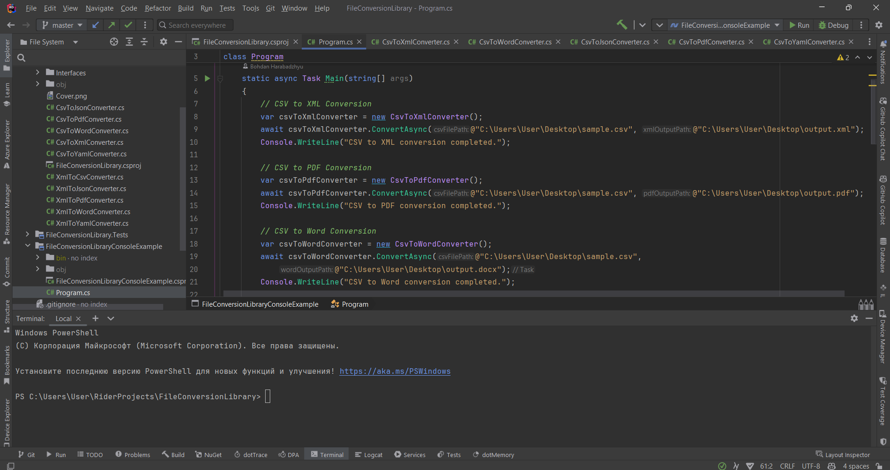

# File Conversion Library



A .NET library for converting CSV and XML files to various formats including XML, PDF, Word, JSON, and YAML. Now with enhanced Stream API and In-Memory conversion capabilities!

## Key Features

-   **Unified API**: A consistent and predictable API across file, stream, and in-memory conversions using strongly-typed options classes.
-   **Robust Parsing**: Advanced heuristics to reliably parse complex and real-world CSV and XML files.
-   **Multiple Conversion Modes**:
    -   **File-Based**: Convert files directly from disk.
    -   **Stream-Based**: For web applications, microservices, and data pipelines.
    -   **In-Memory**: High-performance, low-overhead conversions on data objects.
-   **Extensive Customization**: Fine-tune every aspect of the output with detailed, format-specific options.

## Usage

### 1. File-Based Conversion

The most straightforward way to use the library. All methods now accept a dedicated options class for easy configuration.

```csharp
// Create a single instance of the converter
var fileConverter = new FileConverter();

// --- Example 1: CSV to PDF with custom options ---
await fileConverter.ConvertCsvToPdfAsync(
    "input.csv",
    "output.pdf",
    new PdfConversionOptions { Title = "Sales Report", AlternateRowColors = true }
);

// --- Example 2: XML to JSON with custom options ---
await fileConverter.ConvertXmlToJsonAsync(
    "input.xml",
    "output.json",
    new JsonConversionOptions { UseIndentation = true, ConvertValues = true }
);
```

### 2. Stream-Based Conversion

Perfect for web applications or data pipelines where you need to process data without saving it to disk.

```csharp
// Convert a CSV stream to a PDF byte array for an HTTP response
[HttpPost("convert")]
public async Task<IActionResult> ConvertFile(IFormFile file)
{
    using var inputStream = file.OpenReadStream();
    
    var pdfBytes = await fileConverter.ConvertStreamToBytesAsync(inputStream, 
        new PdfConversionOptions { 
            SourceFormat = "csv", 
            TargetFormat = "pdf",
            Title = "Uploaded Report"
        });
    
    return File(pdfBytes, "application/pdf", "converted_report.pdf");
}
```

### 3. In-Memory Conversion

For maximum performance and flexibility, work directly with data objects.

#### From CSV Data

```csharp
// 1. Create your CsvData object
var csvData = new CsvData 
{ 
    Headers = new[] { "Name", "Age", "City" },
    Rows = new List<string[]> 
    {
        new[] { "John Doe", "25", "New York" },
        new[] { "Jane Smith", "30", "London" }
    }
};

// 2. Convert it to any format with detailed options
var wordBytes = fileConverter.ConvertCsvToWord(csvData, new WordConversionOptions 
{ 
    UseTable = true,
    FontFamily = "Calibri",
    AlternateRowColors = true
});

File.WriteAllBytes("in_memory_report.docx", wordBytes);
```

#### From XML Data

The library supports two ways to provide in-memory XML data:

-   **For Table-Based Formats (CSV, PDF, Word):** Provide pre-parsed `Headers` and `Rows`.
-   **For Tree-Based Formats (JSON, YAML):** Provide the full `XDocument`.

```csharp
// --- For Table-Based output (e.g., PDF) ---
var xmlDataForTables = new XmlData
{
    Headers = new[] { "Product", "Price", "Category" },
    Rows = new List<string[]>
    {
        new[] { "Laptop", "999.99", "Electronics" },
        new[] { "Book", "29.99", "Education" }
    }
};
var pdfBytes = fileConverter.ConvertXmlToPdf(xmlDataForTables, new PdfConversionOptions { Title = "Product Catalog" });


// --- For Tree-Based output (e.g., JSON) ---
var xmlContent = @"<products><product><Name>Laptop</Name><Price>999.99</Price></product></products>";
var xmlDataForTree = new XmlData { Document = XDocument.Parse(xmlContent) };

var json = fileConverter.ConvertXmlToJson(xmlDataForTree, new JsonConversionOptions { UseIndentation = true });
```

## Configuration Options

Customize your output by passing an options object to any conversion method.

-   **`JsonConversionOptions`**: Control indentation, data type conversion, object nesting, and more.
-   **`PdfConversionOptions`**: Set titles, font sizes, page orientation, and row styling.
-   **`WordConversionOptions`**: Generate a table or hierarchical text, set fonts, and style rows.
-   **`XmlConversionOptions`**: Define output structure (elements vs. attributes), naming conventions, and metadata.
-   **`YamlConversionOptions`**: Choose data structure, naming conventions, and data type handling.
-   **`CsvConversionOptions`**: Specify delimiters, quoting behavior, and attribute handling for XML sources.

## Contributing

Contributions are welcome! Please feel free to submit a Pull Request.

## Author

Bohdan Harabadzhyu

## License

This project is licensed under the MIT License - see the [LICENSE](LICENSE) file for details.