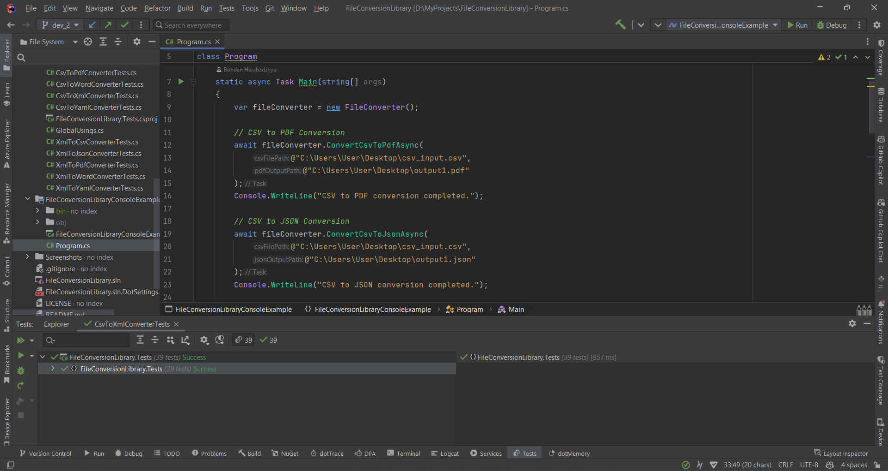

# File Conversion Library


This library provides functionality to convert CSV and XML files to various formats such as XML, PDF, Word, JSON, and YAML.

## Usage

### Initializing the FileConverter

To use the library, you need to create an instance of the `FileConverter` class.
```csharp
// Create a new instance of the FileConverter
var fileConverter = new FileConverter();
```

### CSV to XML Conversion

```csharp
await fileConverter.ConvertCsvToXmlAsync(
    @"C:\Users\User\Desktop\input.csv",
    @"C:\Users\User\Desktop\output.xml"
);
```

### CSV to PDF Conversion

```csharp
await fileConverter.ConvertCsvToPdfAsync(
    @"C:\Users\User\Desktop\input.csv",
    @"C:\Users\User\Desktop\output.pdf"
);
```

### CSV to Word Conversion

```csharp
await fileConverter.ConvertCsvToWordAsync(
    @"C:\Users\User\Desktop\input.csv",
    @"C:\Users\User\Desktop\output.docx"
);
```

### CSV to YAML Conversion

```csharp
await fileConverter.ConvertCsvToYamlAsync(
    @"C:\Users\User\Desktop\input.csv",
    @"C:\Users\User\Desktop\output.yaml"
);
```

### CSV to JSON Conversion

```csharp
await fileConverter.ConvertCsvToJsonAsync(
    @"C:\Users\User\Desktop\input.csv",
    @"C:\Users\User\Desktop\output.json"
```

### XML to CSV Conversion
```csharp
await fileConverter.ConvertXmlToCsvAsync(
    @"C:\Users\User\Desktop\input.xml",
    @"C:\Users\User\Desktop\output.csv"
);
```

### XML to PDF Conversion
```csharp
await fileConverter.ConvertXmlToPdfAsync(
    @"C:\Users\User\Desktop\input.xml",
    @"C:\Users\User\Desktop\output.pdf"
);
```

### XML to Word Conversion
```csharp
await fileConverter.ConvertXmlToWordAsync(
    @"C:\Users\User\Desktop\input.xml",
    @"C:\Users\User\Desktop\output.docx"
);
```

### XML to YAML Conversion
```csharp
await fileConverter.ConvertXmlToYamlAsync(
    @"C:\Users\User\Desktop\input.xml",
    @"C:\Users\User\Desktop\output.yaml"
);
```

### XML to JSON Conversion
```csharp
await fileConverter.ConvertXmlToJsonAsync(
    @"C:\Users\User\Desktop\input.xml",
    @"C:\Users\User\Desktop\output.json"
);
```

## Notes
Notes
The CsvToXmlConverter, CsvToJsonConverter, CsvToPdfConverter, CsvToWordConverter, and CsvToYamlConverter classes read a CSV file, parse it, and write the content to an XML, JSON, PDF, Word, and YAML file respectively. The first line of the CSV file is assumed to be the header.

The XmlToCsvConverter, XmlToJsonConverter, XmlToPdfConverter, XmlToWordConverter, and XmlToYamlConverter classes read an XML file, parse it, and write the content to a CSV, JSON, PDF, Word, and YAML file respectively. The XML file is assumed to be in the format produced by the CsvToXmlConverter.

All classes handle errors such as file not found and invalid file format, and print an error message to the console.

## Contributing

Contributions are welcome. Please fork the repository and create a pull request with your changes.

## Author

Bohdan Harabadzhyu

## License

[MIT](https://choosealicense.com/licenses/mit/)